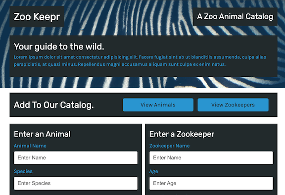
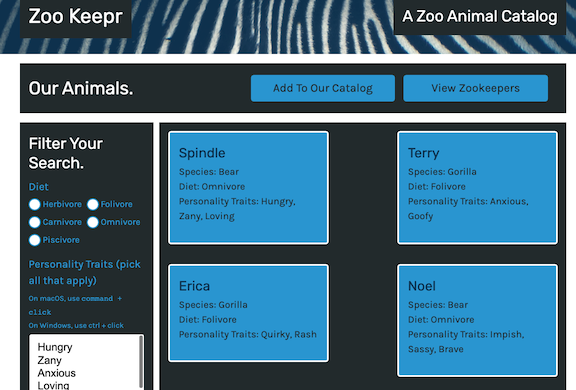
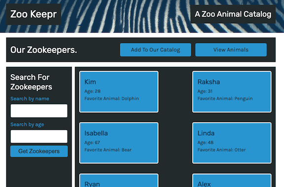
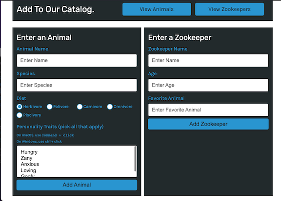

# Zookeeper

## Description

Zookeeper is a digital information management system built using Express.js and deployed to heroku. Users can view zookeepers located at a certain zoo, as well as the animals. Users can also use the webpage to add animals to their catalog

## Table of Contents

- [Installation](#Installation)
- [Usage](#Usage)
- [License](#License)
- [Questions](#Questions)
- [Heroku](#Heroku)

## Installation

Clone the repository to your local machine. Run the command `npm i` to install the local dependencies needed for this project.

## Usage

From the root folder of this repository, run the command `node server.js`. Access the website through your local host where all the functionality is available and data is saved

   
   
   
   

## License

A short and simple permissive license with conditions only requiring preservation of copyright and license notices. Licensed works, modifications, and larger works may be distributed under different terms and without source code.

## Questions

If you have any questions, concerns, or comments, feel free to contact me:

-GitHub: [Zacharycampanelli](https://github.com/Zacharycampanelli)  
-Email: [zaccamp@optonline.net](mailto:zaccamp@optonline.net)

## Heroku
View the deployed application [here](https://floating-earth-19494.herokuapp.com/)